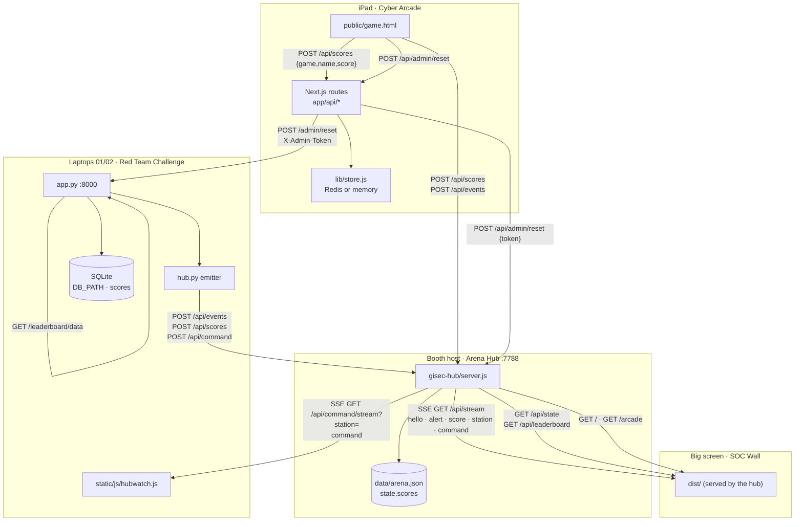
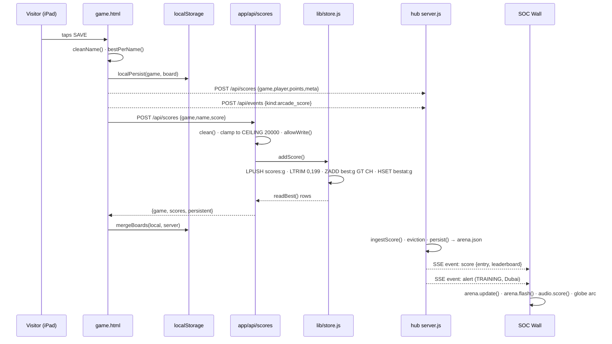
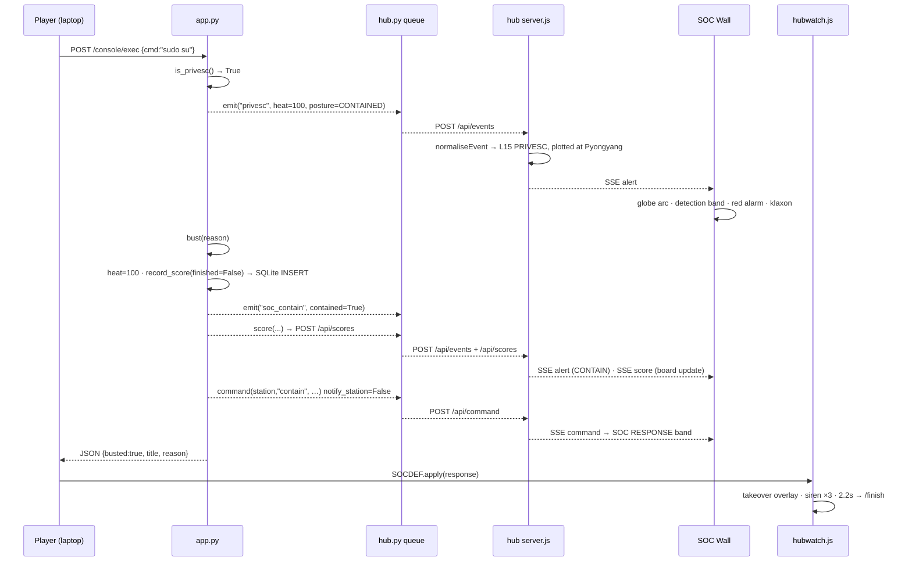

# DMATICS Cyber Arena — the code, explained

**DMATICS IT Solutions LLC · GISEC 2026 · Hall 4, Dubai World Trade Centre**

This document is for whoever now owns this repository. It covers every file that
matters, how the four surfaces fit together, and — in the most detail — where
each of the three leaderboards physically lives and how a score gets there.

Every claim below is taken from a line of code. File and line references are
given throughout so you can check any of them.

---

## 1. The one-paragraph version

DMATICS runs a trade-show stand with four screens on it. A visitor picks up an
iPad and plays a sixty-second game (**Cyber Arcade**: Phish Hunter, Alert Rush or
Breach Point). Two other visitors sit at laptops and try to break into a
fictional company called Aegis Vault Systems in a five-stage capture-the-flag
(**Red Team Challenge**), while a simulated blue team watches them, warns them,
throttles them and eventually cuts them off. Everything all three of them do is
posted to a small LAN service (**the Arena Hub**), which reshapes each booth
action into the exact shape of a security detection and fans it out to a
wall-sized display (**the SOC Wall**) — where it appears as an arc on a globe, a
line on an incident feed, and a name on a leaderboard. The point of the whole
arrangement is one specific piece of theatre: the detection appears on the big
screen *before* the containment lands on the laptop, so the crowd sees cause and
then effect, and the interruption reads as a consequence rather than as a bug
(`README.md:12-14`).

---

## 2. A map

### Root

| Path | What it is |
|---|---|
| `start.mjs` | The cross-platform launcher. Builds the wall if needed, starts the hub, optionally brings up the challenge under Docker, prints every LAN address. 304 lines, no dependencies. |
| `simulate.mjs` | Rehearsal: drives a whole red team run against the real Flask app, plus arcade scores. `--clean`, `--bust`, `--arcade`. |
| `simulate.sh` | The older bash version of the same thing (needs curl + a cookie jar; Unix only). |
| `run-local.sh` | Bash test rig: hub on `:7788`, Flask on `:8000`, no Docker, no npm build. Logs to `./logs/`. |
| `run-local.cmd` | Windows double-click wrapper around `start.mjs`. |
| `network-check.sh` | Diagnoses "why can't the iPad reach this machine" — bind address, VM NAT, firewall, wrong network. `--fix` offers to open the ports. |
| `push-to-github.sh` | One-shot publish; refuses to push if it finds a secret in the tree. |
| `package.json` | Root scripts: `start`, `build`, `booth`, `simulate*`. No dependencies. |
| `DEPLOY.md` | Local and Vercel deployment, including which two pieces should not go to Vercel and why. |
| `README.md` | The short version of this document. |
| `GISEC-2026-INTEGRATION.md` | The narrative of how three separate projects became one show. |
| `runbook.html` | The show-floor run book (single page, 1227 lines) — set-up, kiosk flags, failure drills. |
| `build-sound-page.py` | Renders `soc-sound-check.html` by inlining `soc-wall-main/js/audio.js` verbatim, so the review page and the wall cannot drift apart. |
| `soc-sound-check.html`, `soc-alert-sounds.wav` | The sound-design review artefacts produced by that script. |
| `logs/` | Runtime logs and PID files from `run-local.sh`. Gitignored. |

### `gisec-hub/` — the LAN service

| Path | What it is |
|---|---|
| `server.js` | The whole hub. 984 lines, `node:http` + `node:fs` only, port 7788. Ingest, normalisation, the unified leaderboard, two SSE fan-outs, admin reset, and static hosting for the wall and the arcade. |
| `data/arena.json` | The hub's persisted state: raw score submissions per game plus running totals. Gitignored. |
| `.env.example` | `ADMIN_TOKEN`, optional `WALL_DIR` / `ARCADE_DIR`. |

### `soc-wall-main/` — the big screen

| Path | What it is |
|---|---|
| `index.html` | The wall's markup: left metric rail, hero with the globe and the operation card, AI panel, timeline, and the lower deck that holds the arena leaderboards. |
| `public/soc-config.js` | Booth configuration, served **unbundled** so it can be edited with a text editor on the show floor. Copied verbatim into `dist/`. |
| `js/main.js` | Composition root. Wires every module together, owns the polling loops and the hub handlers. |
| `js/hub.js` | Arena Hub client: resolves the hub address safely, opens `/api/stream`, owns the reconnect backoff, and does the one-shot `/api/state` prime. |
| `js/alerts.js` | The alert store — `normalise()`, the 15-minute window, origin aggregation — plus the origin list and incident card renderers. |
| `js/arena.js` | The five leaderboard columns and the station chips. |
| `js/response.js` | The response theatre: operation card, detection band, red alarm layer, klaxon. |
| `js/globe.js` | The WebGL globe (three.js, world-atlas topojson). 756 lines. |
| `js/fit.js` | Scales the fixed 1920×1080 surface to whatever screen it is plugged into. |
| `js/audio.js` | Synthesised alert audio — no files at all. |
| `js/api.js` | The adapter boundary for the four non-booth feeds, and the `CLASS` table. |
| `js/campaign.js` | Derives the ACTIVE CAMPAIGN card and the AI assessment from the live alert stream, with hysteresis. |
| `js/ai.js`, `js/ticker.js`, `js/timeline.js`, `js/health.js`, `js/charts.js`, `js/details.js`, `js/clock.js`, `js/particles.js`, `js/escape.js` | AI panel typing; ticker and intel; timeline enrichment; infrastructure health rows; sparklines; the investigation dialog registry; venue-local time formatting; ambient canvas; the single shared HTML escaper. |
| `css/*.css` | `reset`, `theme` (tokens), `layout` (487 lines), `animations`. |
| `vite.config.ts`, `build/sites-vite-plugin.ts`, `vercel.json` | Build config, a post-build packaging plugin, and Vercel headers. |
| `dist/` | The built wall. This is what the hub serves. |

### `DMATICS-Red-Team-Challenge-main/` — the CTF

| Path | What it is |
|---|---|
| `app.py` | 1403 lines and the heart of the project: the five-stage chain, the heat engine, containment, the SQLite leaderboard, and every route. |
| `hub.py` | Non-blocking, never-raising, bounded-queue emitter to the Arena Hub. Standard library only. |
| `serve.py` | Runs the app without Docker; picks waitress on Windows, gunicorn elsewhere. |
| `templates/` | `base`, `index` (registration), `brief` (Mission Control), `portal`, `directory`, `login`, `dashboard`, `share`, `console`, `finish`, `leaderboard`, `_flags` partial. |
| `static/js/hubwatch.js` | The heat meter, the takeover overlay, and the operator command channel. |
| `static/js/soc.js`, `win.js`, `sound.js`, `fx.js`, `matrix-bg.js` | The containment alert dialog; the victory takeover; synthesised audio; reveal animations; the digital-rain canvas background. |
| `challenge_files/` | `onboarding_guide.txt`, `passwords.txt`, `Q3_financials.csv` — the loot on the fake share. |
| `data/leaderboard.db` | The SQLite leaderboard. Gitignored. |
| `tests/test_game_logic.py` | 289 lines of regression tests, no pytest, driven through Flask's test client against a throwaway database. |
| `Dockerfile`, `docker-compose.yml` | gunicorn with `--preload`, 2 workers, 4 threads, `:8000`, a real HTTP healthcheck, and every tuning dial as an environment variable. |

### `dmatics-cyber-arcade-main/` — the iPad

| Path | What it is |
|---|---|
| `public/game.html` | The entire arcade — all three games, audio, animated backgrounds, the review screen, the leaderboard, the kiosk-setup panel. 2381 lines, one self-contained document, works from a USB stick. |
| `app/page.js` | Mounts `game.html` in a full-bleed iframe, cache-busted by commit SHA, forwarding `?hub=`. |
| `app/layout.js`, `app/globals.css` | The Next.js shell and PWA metadata. |
| `app/api/scores/route.js` | `GET`/`POST /api/scores`. Name cleaning, a 20,000 ceiling, and the per-client write budget. |
| `app/api/health/route.js` | Answers "why aren't scores saving?" in one request. |
| `app/api/admin/reset/route.js` | The global reset — clears the arcade, then the hub and the challenge. |
| `lib/store.js` | The arcade leaderboard storage: Redis detection, sorted sets, and the in-memory fallback. |
| `next.config.js` | Security headers and the CSP shaped around a single inline-script document. |
| `PLAN.md`, `README.md` | Project notes. |

### The traffic between them



---

## 3. How a score reaches a leaderboard

There are **three** leaderboards. They are separate stores with separate
lifetimes, and nothing reconciles them. Understanding which is which is the
single most useful thing to know about this codebase.

| Board | Lives in | Physical store | Who reads it |
|---|---|---|---|
| **Arcade board** | `dmatics-cyber-arcade-main/lib/store.js` | Redis sorted set + list, or process memory | The iPad's own leaderboard and Hall of Fame |
| **Hub / arena board** | `gisec-hub/server.js`, `state.scores` | `gisec-hub/data/arena.json` | The SOC Wall's five columns |
| **Red team board** | `DMATICS-Red-Team-Challenge-main/app.py` | SQLite at `DB_PATH`, table `scores` | The challenge's own `/leaderboard` page |

Plus a fourth, per-device copy: the iPad's `localStorage`
(`public/game.html:2109-2113`), keyed `dm_phish` / `dm_soc` / `dm_breach`
(`game.html:1679-1700`, the `boardKey` in each game's `META`). It is a cache and
a fallback, not a source of truth, but it is what the tablet paints from first.

### 3a. The arcade board — `lib/store.js`

Four keys per game, where `<game>` is one of `phish`, `soc`, `breach`
(`lib/store.js:13`):

| Key | Type | Purpose |
|---|---|---|
| `best:<game>` | sorted set | member = player name, score = their best points. **The board.** (`:28`) |
| `bestat:<game>` | hash | player name → timestamp of that best (`:29`) |
| `scores:<game>` | list | append-only record of every attempt (`:16`) |
| `board:<game>` | blob | legacy pre-sorted-set format, still merged on read (`:209`) |

`MAX = 10` rows on the board (`:14`). `KEEP = 200` raw entries retained per game
(`:15`), enforced by `LTRIM 0 KEEP-1` after every push (`:259`).

**Why the sorted set exists.** The board used to be derived from the tail of the
list. The list is trimmed to 200, which over a four-day show is a few hours of
play — so the highest score of day one was deleted on day two and the board
silently became "best of this afternoon". The comment at `:18-27` records the
verification: one 9,999 followed by 250 ordinary plays, and the 9,999 was gone.

`ZADD … GT` (`:104` for TCP Redis, `:130` for the REST client) is the fix. `GT`
means the member's score only ever moves *up*, so a later worse round cannot
knock a player's best off the board, and it is a single atomic command — no
read-modify-write for two kiosks to race on. `CH` makes the command return 1 only
when the value actually changed, which is what gates the timestamp write:

```
lib/store.js:263-267
  const changed = await c.zadd(BEST + game, score, name).catch(() => null);
  if (changed && typeof c.hset === 'function') {
    await c.hset(WHEN + game, name, entry.t).catch(() => {});
  }
```

Reads go through `readBest()` (`:222-235`): top `MAX` from the sorted set,
timestamps from the hash, and the raw list merged in on top. The merge is
deliberate — on a deployment that predates the sorted set, the recent list
entries carry the board until each player's first write backfills the set
(`:216-221`). If the store has no `ztop` the function returns `null` and the
caller falls back to `sortTrim(readAll(...))` rather than showing an empty board
(`:244-245`).

`sortTrim()` (`:37-47`) collapses to one row per player at their best, so a
visitor who plays five times occupies one line.

**How the store is detected.** Deliberately not by reading a named environment
variable, because variables can be present while the client still fails to
connect — which looks exactly like "the database is attached but nothing saves"
(`:9-11`).

1. `findBySuffix(suffix)` (`:55-60`) scans **every** key in `process.env` for one
   whose uppercased name *ends with* the suffix, is non-empty, and does not
   contain `READ_ONLY`. This is because Upstash's Vercel integration prefixes
   every variable with the store name — `dmatics_arcade_KV_REST_API_URL` — so
   matching exact names finds nothing. It returns the shared prefix so URL and
   token can be paired.
2. `candidates()` (`:65-80`) returns a **list**, best transport first: Vercel KV
   REST, then Upstash REST, then a plain `REDIS_URL` / `KV_URL` TCP URL. A list
   rather than one winner, so if REST credentials exist but the endpoint refuses,
   the TCP URL is still tried instead of silently dropping to memory (`:62-64`).
3. `openFirstWorking()` (`:152-162`) constructs each client and calls `ping()` —
   it must actually answer, not merely construct.
4. `db()` (`:164-170`) caches the promise across warm invocations, and clears the
   cache on failure so the next request retries.
5. `isPersistent()` (`:182-195`) does one more real `ping()` and caches the answer
   for `PERSISTENT_TTL_MS = 5000` (`:180`). The cache exists because every
   `/api/scores` GET and POST calls it, and it used to ping the store each time on
   top of the ping `db()` already does — two extra round trips per request to
   render a badge that changes about once a show (`:174-178`).

**`persistent: false`.** Both API responses carry it
(`app/api/scores/route.js:50, :88`). When it is false, the board is the
module-scope `mem` object (`lib/store.js:32`): it works, but every serverless
instance has its own copy and everything is lost on redeploy. The arcade renders
this honestly as a **TEMPORARY** badge rather than letting the crew trust a board
that will not last (`game.html:2118-2120`). `/api/health` says the same thing in
one sentence — *"Scores are NOT being saved — the board is in serverless memory
and resets"* (`app/api/health/route.js:16-18`) — and `diagnose()`
(`lib/store.js:279-327`) backs it with a real write/read/delete round-trip
against one fixed probe key.

There is also a write budget: `allowWrite()` (`:362-376`) allows 30 writes per
60-second window per client address, backed by the shared store when there is one
so the limit holds across instances. `/api/scores` takes an unauthenticated POST
because the thing posting is an iPad on a trade-show LAN with nowhere to keep a
secret — the budget does not make the endpoint authentic, it makes it
un-spammable, which is the property that actually matters (`:346-358`).

### 3b. The hub board — `gisec-hub/server.js`

Everything lives in `state.scores`, an object keyed by game with an array of raw
submissions each (`server.js:151`). Four games are registered: `phish`, `soc`,
`breach`, `redteam` (`:70-75`) — one registry, deliberately, because the arcade's
own `PLAN.md` called out that its game list was hardcoded in seven places
(`:66-68`).

Limits (`:78-80`):

| Constant | Value | Meaning |
|---|---|---|
| `MAX_BOARD` | 12 | rows returned per game board |
| `MAX_RAW` | 400 | raw submissions retained per game |
| `MAX_FEED` | 60 | recent alerts replayed to a late-joining wall |

**Per-player-best eviction.** `boardFor()` (`:434-443`) derives the board from
the raw window, keeping one row per player at their highest score. That makes the
raw window load-bearing, and it is why the eviction in `ingestScore()`
(`:577-592`) is not a simple truncate:

```
gisec-hub/server.js:578-591
  const keep = new Map();       // best row per player, always survives
  … build keep …
  const champions = new Set(keep.values());
  const survivors = state.scores[game].filter((row) => champions.has(row));
  for (const row of state.scores[game]) {
    if (survivors.length >= MAX_RAW) break;
    if (!champions.has(row)) survivors.push(row);
  }
  state.scores[game] = survivors.slice(0, MAX_RAW);
```

Every player's personal best survives unconditionally; the newest ordinary rows
fill the remaining space. The comment above it (`:568-576`) records why: with a
plain `length = MAX_RAW`, a record set on day one was deleted once 400 later
plays arrived, and because `overallBoard()` normalises every game to its own top
score, losing the record retroactively rescored every player in the cross-game
board too.

**The overall board** (`:450-467`) is not a points total. Red Team maxes at 100
and Breach Point can pass 2,000, so summing them would make the arcade the only
game that matters. Each game is normalised to 1,000 points at that game's current
top score, so being best-in-class counts the same everywhere and playing more
games beats grinding one.

**Persistence.** `persist()` (`:195-208`) sets a dirty flag and debounces two
seconds — a booth generates a score every few seconds at most. `writeState()`
(`:210-232`) does the durable write:

1. `mkdir -p` the data directory,
2. open `arena.json.tmp`, `writeFile`, **`handle.sync()`**,
3. `rename` the tmp over `arena.json`,
4. only then clear `dirty`, so a failure retries.

The `fsync` is the part that is easy to drop. `rename(2)` is atomic for the
directory *entry* only — it says nothing about whether the data reached the
platter, so a power cut a second after a write can leave a zero-length or torn
`arena.json`, which `loadState()` then discards as unreadable: the entire
leaderboard gone at the start of day two (`:216-219`).

**Shutdown flush.** `flushAndExit()` (`:239-264`) clears the debounce timer and,
if still dirty, writes synchronously — using the *same* tmp-then-rename, because
`writeFileSync` opens with `'w'`, which truncates first. On Windows the launcher
stops the hub with `taskkill /F`, i.e. `TerminateProcess` with no unwinding, so a
kill landing between the truncate and the write leaves a zero-length file
(`:246-253`). It is registered for `SIGINT`, `SIGTERM`, `SIGHUP` and `SIGBREAK`
(`:269-271`) — `SIGHUP` is what Windows sends when the console window is closed
and `SIGBREAK` is Ctrl+Break, which are the two ways of ending a show day that
are not Ctrl-C.

**`loadState()`** (`:164-190`) validates every row rather than trusting the file:
each entry needs a string `n` and finite `s` and `t`. An entry missing `n` used
to sail through and then throw inside `leaderboardPayload()`, which on
`/api/stream` left the wall with an open connection that never sent anything — a
blank screen with no error for the whole show (`:169-172`). Totals are read by
explicit key rather than `Object.assign`, so a crafted file cannot reshape
`state.totals` with a key named `__proto__` (`:180-181`).

**One thing to know.** `ingestEvent()` (`:534-550`) ends with `return alert;` and
the `persist()` call sits *after* the return, so it never executes. The block
comment there describes the problem it was meant to solve — that `events`, `runs`,
`wins` and `busts` only reach disk as a side effect of an unrelated score post —
and the fix is not actually wired up. In practice a red team run that ends without
any score being posted still contributes nothing to the persisted totals. Score
rows themselves are unaffected: `ingestScore()` calls `persist()` normally at
`:593`.

### 3c. The red team board — SQLite

`DB_PATH` (`app.py:67-68`) defaults to `<app dir>/data/leaderboard.db`. The
default is *not* `/app/data` — that is the container path set by the Dockerfile
and compose, and on Windows a leading `/` means "root of the current drive", so
the leaderboard landed in `C:\app\data\` or `D:\app\data\` depending on where you
launched from. The Docker environment variable still overrides it (`:61-66`).

One table (`app.py:205-215`):

```sql
CREATE TABLE IF NOT EXISTS scores (
    id         INTEGER PRIMARY KEY AUTOINCREMENT,
    player     TEXT    NOT NULL,
    points     INTEGER NOT NULL DEFAULT 0,
    flags      INTEGER NOT NULL DEFAULT 0,
    seconds    INTEGER NOT NULL DEFAULT 0,
    finished   INTEGER NOT NULL DEFAULT 0,
    created_at TEXT    NOT NULL
)
```

One row per finished **or busted** run — the board is a record of attempts, not
of victories.

`save_score()` (`:226-238`) is the only INSERT. It wraps the connection in
`contextlib.closing`, because without it a `database is locked` on a bind-mounted
volume skipped `con.close()`, leaked the handle, left `p["saved"]` False, and let
the exception escape through `record_score` into `bust()` — so the containment
theatre ended in a 500 page in front of the crowd instead of a red screen
(`:227-231`).

`record_score(finished)` (`:603-613`) is the one-shot gate. It returns
immediately if `p["saved"]`, writes the row, sets `saved`, and then mirrors the
same run to the hub via `hub.score()`. The local SQLite board stays the source of
truth for `/leaderboard`; the hub copy is what puts the operator on the big screen
next to the arcade games (`:610-611`).

**The four paths that record a run:**

| Path | Where | `finished` |
|---|---|---|
| **Win** — the fifth flag is submitted | `submit()` sets `p["ended"] = True` and calls `record_score(finished=True)` (`:1238-1241`) | True |
| **Timeout** — the clock runs out anywhere | `expire_if_over()` sets `ended` and calls `record_score(finished=len(captured)==len(FLAGS))` (`:532-534`) | usually False |
| **Containment** — any bust | `bust()` pins heat to 100 and calls `record_score(finished=False)` (`:627-629`) | False |
| **Re-registration** — a new handle typed into the same browser | `index()` banks the previous occupant's unsaved run before wiping the session (`:777-782`) | computed from their captures |

`expire_if_over()` (`:511-540`) is the one worth dwelling on. `record_score()`
used to be reachable only through `/finish`, and the only thing that sent a live
player there was a JavaScript countdown on Mission Control. So the two most
ordinary things at a booth — running out of time while heads-down in the SSH
console, and walking away — recorded nothing at all. It is now called from
`require_player` (`:681`), so every authenticated route enforces the clock.

The re-registration path matters for the same reason: a visitor who hits Back and
types a new handle used to delete an unsaved run outright, which was the
commonest way a real score never reached the board (`:774-776`). It is wrapped in
a bare `except` that logs and continues, because banking the old run must never
block a new player (`:781-782`).

`/leaderboard/data` (`:1333-1351`) reads the top 15 by
`ORDER BY points DESC, seconds ASC`, and `fmt()` clamps negative seconds to zero
— a backwards clock step produced `-60:01` on the big screen and sorted ahead of
every honest run (`:1342-1344`). `elapsed()` (`:712-727`) clamps at the source
too, to `[0, GAME_SECONDS]`.

### 3d. Trace one: Phish Hunter on the iPad → the SOC wall

The visitor finishes a sixty-second round, types a name, taps SAVE.

1. **`saveScore()`** — `public/game.html:2235`. Cleans the name with `cleanName()`
   (`:2231-2234`, uppercase, `[A-Z0-9 ._-]` only, 12 characters), snapshots
   `score` into `mine` because PLAY AGAIN resets it, pushes `{n, s, me:true}` onto
   the local board, collapses it with `bestPerName()` (`:2094`), and writes it to
   `localStorage` via `localPersist()` (`:2113`). The on-screen board repaints
   immediately — nothing has left the device yet.
2. **`HUB.score(game, name, mine, meta)`** — `:2218-2224`. Two `POST`s, both
   `keepalive:true` so they still leave the device as the tablet is handed to the
   next visitor, and both with their errors swallowed (`:2205-2212`):
   - `POST <hub>/api/scores` with `{game, player, points, station:'ARCADE-IPAD', meta}`
   - `POST <hub>/api/events` with `{kind:'arcade_score', …}`

   The hub address comes from `HUB.base()` (`:2185-2204`): `window.GISEC_HUB`, then
   `?hub=`, then `localStorage.dm_hub`, then this host on port 7788 — and every
   candidate must pass `usable()` (`:2172-2183`), which requires http(s) and a
   private-LAN hostname. A QR code reading `?hub=https://someone-elses-host` and
   one tap on the iPad would otherwise have permanently redirected the booth's
   telemetry to a stranger, with nothing on screen changing (`:2150-2160`).
3. **`postServerScore(g, name, mine)`** — `:2125-2128`. `POST /api/scores` with
   `{game, name, score}` to whatever `apiBase()` resolves to (`:2077-2083`): the
   host override `window.ARCADE_API`, else same-origin when served over http(s),
   else `null` for a `file://` copy. The reply's `scores` array is merged into the
   local board (never replacing it — `:2085-2090`) and `persistent` updates the
   badge.
4. **Arcade API** — `app/api/scores/route.js:56`. Rejects a non-object body,
   rejects an unknown game, spends one unit of the write budget, cleans the name,
   clamps the score to `CEILING = 20000` (`:13` — the old ceiling was 100,000, so
   `{"score": 99999}` from curl sat permanently at the top of the booth board),
   and calls `addScore()`.
5. **`addScore()`** — `lib/store.js:250-276`. `LPUSH scores:phish`,
   `LTRIM 0 199`, `ZADD best:phish GT CH`, and `HSET bestat:phish` only if the
   score improved. Returns `readBest()`. With no store attached it falls through
   to `mem` (`:274`).
6. **Hub ingest** — `gisec-hub/server.js:887`. `ingestScore()` (`:552`) accepts
   either shape (`input.player ?? input.name`, `input.points ?? input.score`),
   cleans the name to 14 characters (`:282-291`), clamps points to `[0, 100000]`,
   unshifts the row onto `state.scores.phish`, runs the best-preserving eviction,
   and calls `persist()`.
7. **Fan-out** — `:596-598`. The hub broadcasts a `score` event to every wall
   client carrying `{game, entry, scores, persistent, leaderboard}`, where
   `leaderboard` is a full `leaderboardPayload()` (`:469-481`) — all five boards
   plus totals.
8. **The wall** — `js/main.js:399-405`. `onScore({game, entry, leaderboard})`
   calls `arena.update(leaderboard)` to repaint all five columns, then
   `arena.flash(game, entry)` (`js/arena.js:164-172`), which pulses the player's
   row for six seconds so someone watching from the stand sees their own name
   arrive, and `audio.score()` ticks.

The `arcade_score` event from step 2 travels the alert path in parallel: it
becomes a level-7 `TRAINING`-class alert plotted on Dubai, so a small arc appears
on the globe at the same moment.



### 3e. Trace two: a red team run

An operator finishes, times out, or is contained.

1. **`record_score(finished)`** — `app.py:603`. One-shot on `p["saved"]`. Calls
   `save_score(player, points, len(captured), elapsed(), finished)`, which INSERTs
   the row into SQLite (`:226-238`). **That row is the red team board.** It is
   independent of everything below.
2. **`hub.score(...)`** — `app.py:612-613` → `hub.py:144-156`. Builds
   `{game:'redteam', player, points, station, meta:{flags, seconds, finished}}`
   and hands it to `_submit()` (`hub.py:101-120`), which returns immediately: the
   payload goes onto a bounded 500-slot queue (`:51-53`) drained by a daemon
   thread (`:76-88`). If `HUB_URL` is unset, `_submit` is a no-op (`:102`). If the
   hub is down, the failure is counted and discarded — a booth network drops
   packets, and retrying would cost the player a stalled request (`:82-85`). If
   the queue is full, the **oldest** item is shed, because on a wall the most
   recent event is the one the crowd is looking for (`:108-113`).
3. **Hub ingest** — `server.js:887` → `ingestScore()`. Same path as the arcade;
   the row lands in `state.scores.redteam`.
4. **The wall** — the `redteam` column is rendered by `js/arena.js:30-31`, and its
   subline reads the `meta` block: `"3/5 OBJECTIVES · 04:12 ✓"`
   (`js/arena.js:44-48`).

Meanwhile the *narrative* of the run has been arriving all along as events. A
containment is the clearest case:



The ordering is the whole design. `raise_heat()` emits the detection **first,
always, before any escalation it triggers** (`app.py:404-409`), because the wall
renders alerts in arrival order and a containment banner landing before the alert
that caused it destroys the one thing the integration exists to show. On the
laptop side, `hubwatch.js` inserts a deliberate ~1.9-second "SOC IS RESPONDING"
beat before the lockout actually lands (`static/js/hubwatch.js:181-182`) — long
enough for the crowd to see the detection on the big screen and turn to look at
the laptop. Without the beat the two screens fire together and the connection
between them is invisible (`hubwatch.js:11-15`).

Note that `hub.command()` defaults to `notify_station=False`
(`hub.py:159-180`). The station's own browser already learns about the response
in the HTTP reply that triggered it, which is the path that keeps working when
the hub is down; pushing it down the SSE channel as well would fire the takeover
twice. The hub honours this strictly — `notify` is `input.notifyStation === true`
(`server.js:628`), so a client sending `"false"`, `0` or `null` no longer gets the
takeover fired anyway.

---

## 4. The red team game logic

### The stage chain

Five flags, 100 points (`app.py:76-83`):

| Flag | Stage | Phase (`STAGE_NAMES`) | Points | Where it is found |
|---|---|---|---|---|
| FLAG-1 | 1 | Reconnaissance | 10 | View-source on the staff directory |
| FLAG-2 | 2 | Credential Access | 20 | Log in as `john.smith` / `Summer2026` |
| FLAG-3 | 3 | Lateral Movement | 20 | The credential file on the fake share |
| FLAG-4 | 4 | Foothold | 25 | `cat flag.txt` in the fake shell |
| FLAG-5 | 5 | Exfiltration | 25 | The hidden vault file |

Two attempt limits gate the brute-forceable stages: `LOGIN_MAX = 4` and
`SSH_MAX = 3` (`:72-73`).

### `STAGE_REQUIRES` and `PLAY_EVIDENCE` — why both exist

`STAGE_REQUIRES` (`:86`) maps a stage number to the flag you must have
*submitted* to enter it: `{1: None, 2: "FLAG-1", 3: "FLAG-2", 4: "FLAG-3", 5:
"FLAG-4"}`. It is enforced twice:

- `require_stage(n)` (`:697-709`) guards **page access**. Not unlocked → flash a
  message and redirect to Mission Control.
- `submit()` (`:1206-1209`) consults it again for **points**. This is the second
  enforcement, and it was missing: `require_stage` guarded the pages but
  `submit()` never looked at the chain, so anyone who had seen the source or
  watched another player's screen could paste all five flags in two seconds and
  top the board without visiting a stage (`:1200-1205`).

`PLAY_EVIDENCE` (`:641-652`) closes the remaining hole. The five flag values are
constants in the file; they never change between players or runs, and the chain
check above is satisfied simply by pasting them *in order*. The recorded
measurement: five POSTs, 100 points, rank 1, "full clear", 0.02 seconds, without
loading a single stage page — and with heat at 0, so the SOC wall showed a full
compromise with a blank kill chain (`:1213-1219`).

So each flag additionally requires evidence of the thing you must actually have
*done* to find it, drawn from state the session was already tracking:

| Flag | Predicate | Message on failure |
|---|---|---|
| FLAG-1 | `"directory" in p["seen"]` | "open the staff directory on the portal first" |
| FLAG-2 | `p["logged_in"]` | "sign in to the staff portal first" |
| FLAG-3 | any `p["seen"]` entry starting `file:` | "read the credential file on the internal share first" |
| FLAG-4 | `p["shell"]` | "get a shell on the host first" |
| FLAG-5 | `"exfil" in p["seen"]` | "find and read the vault file in the shell first" |

The messages are phrased as a nudge towards the stage rather than an accusation:
a visitor who legitimately found a flag early should be pointed at the door they
skipped, not told off (`:637-640`).

`STAGE_REQUIRES` is about *order*; `PLAY_EVIDENCE` is about *authenticity*. You
need both, because the chain alone is satisfiable by a copied list.

### The heat engine

The design intent, stated at `:110-127`: the original game had only hard rules —
four bad portal logins, three bad SSH logins, any sudo — which are binary and
invisible until they fire. Heat adds a **middle tier**: something the visitor can
feel building, and something the crowd at the big screen can watch building
before it lands. Critically, it is computed *in the game*, not in the hub: the
hub mirrors it to the wall, but if the hub is unplugged the defence still works.
The mechanic must never depend on a second service being up.

**Cost.** `HEAT_COST` (`:144-155`) charges each action:

| Action | Heat | | Action | Heat |
|---|---|---|---|---|
| `recon` | 6 | | `ssh_ok` | 16 |
| `shell_cmd` | 7 | | `auth_fail` | 20 |
| `auth_ok` | 10 | | `ssh_fail` | 28 |
| `flag` | 12 | | `exfil` | 40 |
| `share_loot` | 14 | | `privesc` | 70 |

Tuned so a clean run never trips a throttle and a noisy one trips it about twice
before the hard rules would have caught them (`:142-143`).

**Decay.** `current_heat()` (`:302-309`) is read-only: it subtracts
`HEAT_DECAY_PER_SEC × elapsed` from the stored value and clamps to `[0, 100]`. It
never mutates the session. The default is 0.9 per second (`:132`), and the
comment names it as the dial that matters: at 0.9/s a careful player who takes a
minute per stage sheds more heat than the stage costs and never trips a throttle;
a player who fumbles passwords or hammers the shell trips one every couple of
minutes. Raise it to make the SOC more forgiving when the queue is long
(`:129-131`).

**Thresholds** (`:133-135`): `HEAT_WATCH = 34`, `HEAT_THROTTLE = 62`,
`HEAT_CONTAIN = 96`.

**Posture.** `posture_for()` (`:337-355`) is **derived, not stored**:

```
busted            → CONTAINED
throttle_left > 0 → THROTTLED
heat >= 34        → WATCHED
otherwise         → CLEAR
```

An earlier version wrote posture into the session when it escalated, so a player
stayed flagged THROTTLED for the rest of their run long after the hold expired —
the wall showed a red station and the nav pill said HELD with nothing actually
holding them. Posture is a function of the current heat and the clock, so it is
computed as one. Only containment sticks, because containment really is
permanent (`:339-347`).

**`throttle_left()`** (`:331-334`) is the seconds remaining on
`p["throttled_until"]`, floored at 0.

**`held()` and `held_page()`.** `held()` (`:553-571`) returns a JSON-shaped
refusal when a throttle is active — *"the takeover overlay is theatre; this is the
part that means it"* (`:556-559`). It guards `/portal/login`, `/console/auth`,
`/console/exec` and `/submit`. `/submit` was the last one added, and it is the one
action the whole game is about: under a throttle, with the wall showing the
station red and the overlay up, a player could keep scoring at full speed from
curl or just by closing the overlay (`:1186-1193`).

`held_page()` (`:574-591`) is the page-shaped half — a flash message and a
redirect to Mission Control. It exists because `held()` guarded the four POSTs but
not the four GETs that *raise* heat: `/portal`, `/portal/directory`,
`/dashboard/share` and `/files/<name>`. So a throttled player kept enumerating
during the hold, kept accruing heat, and could collect FLAG-1 out of the directory
while the overlay in front of them said nothing they sent reached the target
(`:576-583`).

### Three-strike containment and `THROTTLE_FORGIVE`

`THROTTLE_LIMIT = 3` (`:138`), `THROTTLE_SECONDS = 12` (`:136`),
`THROTTLE_FORGIVE_SECONDS = 90` (`:140`).

`effective_strikes()` (`:312-328`) computes strikes **on read**, not on write:

```python
strikes - int((time.time() - last_hold) // THROTTLE_FORGIVE_SECONDS)
```

Every 90 seconds of play without a hold takes one strike back. Doing this only at
the moment a new hold fires meant the number never moved anywhere a player could
see it — the nav meter and `/soc/state` kept reporting the raw stored value, so a
session that had genuinely served its time still displayed two strikes
(`:315-322`). Strikes are a function of the clock, like heat and posture, so they
are computed like one.

The design intent is fairness a visitor can feel: one fumble in the first minute
followed by five clean minutes should not still count against them at the finale
(`:434-441`).

The throttle branch (`:429-492`) fires when heat ≥ 62, no hold is active, the
session is not already busted, **and `time_left() > THROTTLE_SECONDS`**. That last
condition exists because a hold the player cannot outlive is a forfeit, not a
setback: held at T-8s with a 12-second hold, they watch the clock die and lose the
25 points they had already earned. In the last few seconds the SOC watches and
does not hold (`:425-428`).

`strikes + 1 >= THROTTLE_LIMIT` promotes the third hold to a containment
(`:458-468`). The comment at `:445-456` explains why counting was necessary
instead of trusting the arithmetic: the heat floor below saturates at
0.85 × 62 = 52.7, and 52.7 plus the loudest single action (exfil, 40) is 92.7 —
under the 96 line. Measured: thirty consecutive vault reads produced twenty-nine
throttles and no containment at all. Three is the number the on-screen copy
already promises and the right number for a booth: two warnings you can come back
from, then the finale.

After a hold that is not the last, heat **resets to a rising floor** rather than
bleeding a fixed amount (`:478-479`):

```python
floor = HEAT_THROTTLE * min(0.85, 0.40 + 0.18 * (throttles - 1))
p["heat"] = min(heat, floor)
```

So 24.8, then 34.7, saturating at 52.7. Subtracting a flat amount left a loud
player hovering just under the line and re-tripping on every single stage, and a
run that is nothing but lockouts teaches nothing (`:474-477`).

The **first warning** (`:497-506`) fires once per run only. Heat crossing 34 again
after cooling off is not news, and a banner every few actions is noise the player
learns to ignore.

### The hard bust rules

Three, all of which end a run outright regardless of heat:

1. **Portal brute force** — `login()` (`:869-881`). On the fourth failure:
   `emit("auth_fail", heat=100, posture=CONTAINED)`, then `bust()`, then
   `hub.command(..., "contain", ...)`.
2. **SSH brute force** — `console_auth()` (`:995-1007`). Same shape after three
   failures.
3. **Privilege escalation** — `console_exec()` (`:1084-1103`), decided by
   `is_privesc()` (`:1024-1039`). This is an **allowlist of one**, not a denylist:
   any command starting `sudo` is escalation except the bare `sudo`, `sudo -l` and
   `sudo --list`; plus anything containing `-exec` (`find -exec` is escalation
   too). It used to require a match against an eighteen-entry token list, so the
   most obvious things a visitor types — `sudo cat /etc/shadow`,
   `sudo -u root /bin/bash` — fell through to "command not found" at zero heat,
   while the console banner promised that sudo escalation ends your run. The player
   got an anticlimax instead of the finale (`:1025-1033`).

`bust()` (`:616-634`) sets `busted`, records the reason, **pins heat to 100**,
records the score, and emits `soc_contain`. The heat pin matters for a specific
two-screen inconsistency: the wall is told `heat=100` on every containment, but
the player's nav meter reads `current_heat()`, so a quiet player who trips a hard
rule saw an *empty* bar labelled CONTAINED on the laptop while the big screen
behind them showed a maxed one (`:620-626`).

Two smaller protections are worth noting. `bust_reason` is truncated to
`cmd[:60]` (`:1092-1098`) because it lives in the session **cookie**: 12 KB of
incompressible input produced a 12,586-byte `Set-Cookie`, the browser dropped it,
and the player's whole run vanished while the leaderboard had already banked a
partial score. And a containment triggered by reading the vault returns
`ok:false` (`:1141-1146`) rather than `ok:true` with the crown jewel in `out` —
otherwise the console printed FLAG-5 two seconds before the overlay arrived, and
the player could read it off the screen and hand it to the next visitor.

There is also a *non*-rule: an unrecognised shell command costs nothing
(`:1155-1159`). A typo is not an intrusion, so the heat meter measures what the
player did, not how well they type. In the same spirit, `/files/<name>` only
charges heat for a file that actually exists, and the existence check uses
werkzeug's `safe_join` — the same check that serves the file — because using
`os.path.join` instead let backslash traversal probes on Windows pass the guard,
charge 14 heat each, and then get refused. Nine probes and the run was over, for
doing precisely what a red-team visitor is invited to try at a hacking booth
(`:925-952`).

### The clock

`GAME_SECONDS` defaults to 600 (`:106`). `elapsed()` (`:712-727`) clamps to
`[0, GAME_SECONDS]`, which fixes two escapes onto the big screen: a laptop
correcting its clock over show-floor wifi could put `started_at` in the future,
producing a negative elapsed that sorted to rank 1 under `ORDER BY seconds ASC`;
and a tab left open for an hour banked 3000 seconds, rendering "50:00" on a
55-inch screen.

`expire_if_over()` (`:511-540`) is called from `require_player` on every
authenticated route (`:681`) and is the authoritative clock. The browser's
countdown is a display: `soc_state()` carries `left` (`:369-374`) and
`hubwatch.js` resyncs the on-page timer from it (`static/js/hubwatch.js:47-51`),
because a backgrounded or slept tab always shows *more* time than the server has
— the player watches 01:40 while `/submit` answers "time's up".

`finish()` (`:1290-1322`) only ends a run when it is genuinely over
(`over = time_left() <= 0 or busted or done or ended`, `:1308`). It used to set
`ended=True` and bank on every visit, so one stray navigation — browser Back from
the debrief, a JS failsafe, an operator command — permanently killed a live run at
whatever score it happened to be on, and every later submit silently did nothing
(`:1303-1307`).

---

## 5. The SOC wall

### How alerts get in

Two feeds, kept entirely separate.

**Ambient telemetry** comes from `js/api.js` — four adapters named for what they
do (alerts, tickets, intel, network) rather than for a product. With
`SOC_CONFIG.demo` true (the booth default, `public/soc-config.js:21`), the wall
generates its own background activity. `pollAlerts()` runs roughly twice a second
in demo mode and every eight seconds otherwise (`js/main.js:268`), because a booth
globe with an arc every four seconds looks asleep.

**Booth activity** comes from the hub. `connectHub()` (`js/hub.js:74-147`) opens
an `EventSource` on `<hub>/api/stream` (`:100`) and listens for five events:
`hello`, `alert`, `score`, `station`, `command`. It owns its own reconnect —
backoff from `RETRY_MIN = 2000` to `RETRY_MAX = 20000`, ×1.6 each time
(`:19-20, :131-135`) — because `EventSource` retries only for network blips, gives
up on some failures, and never re-runs the `hello` handshake, which is what
carries the snapshot (`:121-124`).

`resolveHubUrl()` (`:45-72`) tries, in order: `SOC_CONFIG.hub.url`, then `?hub=`
on the wall URL, then same-origin if `hub.sameOrigin`, then this host on
`hub.port` (default 7788). `?hub=` is filtered through `safeHubUrl()`
(`:37-43`) — http(s) only, and either the same hostname or a private-LAN address
matched by `PRIVATE_HOST` (`:35`). It is the fastest way to repoint the screen
mid-show and it was also an open redirect for the wall's entire data feed:
whoever controls that origin controls the big screen (`:29-34`). The final
fallback is refused on a public hostname, because on a wall served from Vercel it
produced `https://something.vercel.app:7788` and the wall spent the whole show in
a reconnect loop against a port that does not exist (`:60-68`).

Crucially, hub alerts go through the **same alert store** as everything else
(`js/main.js:394-397`), because the hub emits them already shaped to the wall's
contract. A failed password on Laptop 02 reaches the globe, the origin list and
the timeline as an ordinary detection, and nothing downstream needs to know the
difference (`js/hub.js:5-13`).

### The alert store and `normalise()`

`createAlertStore()` (`js/alerts.js:18-111`) keeps `max: 8` alerts on screen
(`main.js:224`) and counts everything over a rolling `WINDOW_MS = 15 * 60_000`
(`:14`) rather than since page load. On a desk that is invisible; on a stand that
runs nine to six it means CRITICAL ALERTS reads four figures by lunchtime and the
number stops meaning anything (`:8-13`). Two baselines make the wall look busy
from boot: `CRITICAL_BASELINE = 14` and `EVENT_BASELINE = 238` (`:15-16`).

`normalise()` (`:41-60`) is described in its own comment as the single most
load-bearing guard on the wall, and the reasoning is worth reading in full at
`:25-40`. Two failure modes:

- A non-numeric `ts` permanently stalls all three prune loops, which walk from the
  head and stop at the first entry that does not compare. A `NaN` parks there
  forever and every later event accumulates — over four days, ~350,000 retained
  records and a counter reading "EVENTS / 15 MIN 357,738".
- A missing `srcLat` is worse and faster: `undefined.toFixed(4)` throws inside
  `renderAlertCards`, which aborts the rest of `renderAlertState` **and** stops
  `theatre.showAlert()` from ever running. So the booth event that just happened
  gets no detection band, no red screen and no klaxon. The show silently stops
  working while the globe keeps spinning.

Everything is coerced through `finite()` and `text()` from `js/escape.js:29-45`,
so every downstream module can trust its inputs. Deduplication is by `id` in a
`seen` set that is trimmed FIFO at 500 down to 400 (`:82-86`) — a full wipe let a
reconnect snapshot replay alerts that had already been counted, double-counting
origins and re-firing hour-old arcs.

`js/escape.js` exists because three modules had a local escaper and three did not,
and the ones that did not were rendering `alert.rule`, `alert.agent` and origin
country names straight from the wire. Anything on the booth LAN can POST to the
hub's ingest, so a visitor's phone on the show wifi could put
`` on the big screen (`js/escape.js:1-13`). The hub escapes
on its side too (`server.js:301-312`), so it is correct on both.

### `fit.js` — the scaling approach

The wall is drawn once at a **fixed 1920×1080 surface** and that whole surface is
scaled to whatever screen it is plugged into (`js/fit.js:42-108`).

The previous build laid out against the live viewport — `100vw`, `100vh`,
vw-driven type — which fits exactly the resolutions it was tuned on. On any other
screen the panels resize but the words inside them do not resize with them, so
text walks out of its box, which is what happened the first time the wall was put
on a television (`:9-16`).

Scaling the finished surface removes the whole class of problem: there is no
reflow to get wrong. `apply()` computes
`min(width/designWidth, height/designHeight) × overscan` and writes it to the CSS
custom property `--fit` (`:62-71`). `overscan` is clamped to `[0.75, 1]` and can
be overridden per screen with `?fit=0.9` on the URL (`:47-48`) — the fastest fix
if a specific panel at the stand crops the edges.

Deliberately **not** scaled: the ambient canvas, the grid overlay and the red
alarm layer are fixed full-bleed elements outside the scaled surface, so they
cover the entire screen including any letterbox band on a non-16:9 display. The
band then reads as part of the wall rather than as a black bar (`:20-25`).

Four things trigger a re-measure, and a fifth catches what they miss: `resize`,
`orientationchange`, `visualViewport` resize, a `ResizeObserver`, plus two
requestAnimationFrames and a one-second timeout for a television still
negotiating HDMI (`:76-86`). And a watchdog polls `clientWidth`/`clientHeight`
every two seconds (`:96-101`), because the wall runs for four days untouched
through HDMI renegotiation, a display waking from standby and a television
changing its own output mode — a coalesced resize event would otherwise leave the
surface at the wrong scale until someone noticed. `apply()` also short-circuits
below a 0.0005 change (`:67`) and the settled scale is exposed as
`globalThis.SOC_FIT` for the run book's diagnostics (`:105`).

### Where the leaderboards render

The lower deck (`index.html:184-199`). `#arena-board` is filled by
`createArenaPanel()` (`js/arena.js:52`), which renders five columns in the order
`overall, phish, soc, breach, redteam` (`:19`), eight rows each (`:21-32`). An
earlier version rotated one board at a time through a small panel, so a visitor
who wanted to know where they placed had to stand and wait for it to come round,
and three of the four games were invisible at any moment (`:5-9`).

Unclaimed ranks are drawn as dimmed ghost rows (`:99-103`) so every column is the
same height from the moment the doors open — a half-filled panel reads as broken
rather than as early in the day, and a board that visibly has room left in it is
what makes a visitor want their name on it. `#arena-stations` holds up to four
station chips (`:142`), toned by posture.

Every column is also a detail trigger: clicking one opens the investigation dialog
with the full board and the arena totals (`:60-86`).

### The audio layer

`js/audio.js`. Every sound is synthesised in the browser — there is not a single
audio file, so there is nothing to lose off a USB stick and nothing that stops
working when the booth has no internet (`:5-7`). Five cues: ATTENTION (a rising
perfect fourth), ELEVATED (three notes that do not resolve), CRITICAL (three
tritone double-stops), KLAXON (the containment alarm, with a 65 Hz sub swell), and
CLEARED (a falling triad) (`:14-27`). The graph is gain → compressor → speakers,
and the compressor is not decoration: a booth television's speakers distort badly
on a loud low tone (`:71-75`).

Two rules keep it from being switched off by lunchtime on day one (`:29-36`):

1. **Ambient telemetry is silent.** Only real booth activity makes a sound.
2. **Everything is rate limited.** `MIN_GAP_MS = 700` between ordinary cues,
   `URGENT_COOLDOWN = 5000` between critical ones, and a bucket of
   `BUCKET_LIMIT = 10` ordinary cues per `BUCKET_WINDOW = 30000` (`:47-50`).
   Critical cues can interrupt; ordinary ones cannot.

Configuration is `SOC_CONFIG.sound` — `enabled`, `volume` (0.7 default),
`scoreBlips` — overridable per screen with `?sound=off` and `?volume=0.3`
(`:54-62`). Browsers will not let a page make noise before someone interacts with
it and nobody interacts with a wall display, so either launch Chrome with
`--autoplay-policy=no-user-gesture-required` or click the screen once; until then
a small prompt sits in the corner and removes itself the moment audio is live
(`:38-42`).

`build-sound-page.py` renders a review page by inlining this exact file, so what a
reviewer hears is the code that runs on the wall rather than a second copy of the
sound design that could drift.

---

## 6. The hub

Four jobs and nothing else (`server.js:11-22`): ingest, normalise, score, fan out.

### The event vocabulary

`EVENT_TYPES` (`:88-110`) maps each booth action to a severity `level`, a `heat`
weight, a DMATICS threat class `cls`, and a default `rule` string.

| Group | Kinds |
|---|---|
| Red team | `run_start`, `recon`, `auth_fail`, `auth_ok`, `share_loot`, `ssh_fail`, `ssh_ok`, `shell_cmd`, `privesc`, `flag`, `exfil` |
| SOC responses | `soc_monitor`, `soc_throttle`, `soc_contain`, `run_end`, `run_win` |
| Arcade | `arcade_start`, `arcade_score` |

Levels run 6–15; `privesc` and `exfil` carry the heaviest heat weights (70 and
40). The `heat` field is what drives the escalation ladder and the wall reads only
`level` and `cls`, so the two concerns stay separate (`:84-86`).

### Booth event → wall-shaped alert

`normaliseEvent()` (`:324-374`) produces exactly the object `fetchAlerts()`
already returns, plus a `gisec` block for the arena-specific panels. Anything that
reads only the standard fields — globe, origins, timeline — needs no changes at
all (`:318-322`).

- **Kind** is looked up with `Object.hasOwn`, not truthiness, because
  `EVENT_TYPES['constructor']` is truthy and a `constructor` kind produced an
  alert with a null level and no class that was then broadcast to every wall
  client (`:325-328`). Unknown kinds fall back to `shell_cmd`.
- **Geography** comes from `GEO` (`:132-145`), keyed by threat class. The stations
  are physically in Hall 4, so a truthful arc would be a dot on Dubai and nothing
  to look at. Instead each phase is plotted at the exit infrastructure a real
  operator would route it through — which is also what a SOC sees in source-IP
  geolocation. RECON→Amsterdam, CRED→Moscow, PRIVESC→Pyongyang, EXFIL→Beijing,
  CONTAIN and TRAINING→Dubai. Coordinates get ±0.45° of scatter so repeat events
  from one station do not stack into a single pixel (`:346-347`).
- **Sanitising**: `cleanStation` (16 chars of `[A-Z0-9-]`), `cleanName` (14 chars),
  `escapeText` (entity-escaping, length-capped). `level` is clamped to `[5,15]`,
  `heat` to `[0,100]`, `posture` must be one of five literals, `game` must be a
  registered key, `stage` is escaped to 40 characters.

`touchStation()` (`:379-416`) maintains one live posture record per station. It is
capped at `MAX_STATIONS = 64` (`:309`) because a station id is any 1–16 characters
of `[A-Z0-9-]`, giving ~37¹⁶ possible keys with nothing capping the map —
measured at ~12,000 new stations a second from a single unauthenticated POST loop,
each also fanning out a broadcast to every wall client (`:382-385`). A `run_start`
resets the record wholesale, including player and stage, because not resetting
them showed the next visitor's fresh run credited to the previous one and already
at the final stage (`:400-409`). `reapStations()` (`:420-427`) deletes anything
unseen for 15 minutes and de-activates anything quiet for 3, so the wall never
shows a ghost operator from forty minutes ago.

### The two SSE fan-outs

**`GET /api/stream`** — the wall (`:838-860`). Opens the stream, adds the response
to `wallClients`, registers the close handler **before** building the hello
payload, then sends a `hello` carrying the last 24 alerts, all station postures
and the full leaderboard. The ordering is deliberate: `leaderboardPayload()` runs
outside `send()`'s try, so anything it threw used to skip the cleanup line
entirely — the wall got an open connection that never sent data and never errored,
so `EventSource` never retried and the big screen stayed blank, while the hub kept
a dead response in `wallClients` forever (`:841-846`).

Thereafter it receives `alert`, `score`, `station` and `command` events.

**`GET /api/command/stream?station=LAPTOP-01`** — the red team laptops
(`:863-877`). Keyed by cleaned station id into `stationClients`, a
`Map<string, Set<res>>`, with the set deleted when it empties.

Both share `send()` (`:497-510`), which enforces backpressure: if
`response.writableLength > 1_000_000` the socket is destroyed. The return value of
`write()` used to be discarded, so one reader that stopped reading — a laptop with
its lid shut, a wifi client with a zero window — buffered without limit. Measured
at 51 MB to 200 MB of RSS and still climbing, while `/api/health` cheerfully
reported the client as connected (`:498-504`). A keep-alive comment goes out every
20 seconds (`:524-529`), because proxies and browsers drop an idle SSE socket
after about sixty.

### The containment command path

`POST /api/command` → `issueCommand()` (`:607-638`). The action is one of
`monitor`, `throttle`, `contain`, `release`; `seconds` is clamped to `[0,120]`
with a default of 12 for a throttle; title and reason fall back to the standard
copy at `:640-652`.

It always broadcasts to the wall. It broadcasts to the *station* only if
`notifyStation === true` (`:628`), for the reason described in §3e.

The endpoint has two gates (`:895-917`), in order of how much they cost the crew:

1. `sameOriginRequest()` (`:667-674`) — a browser cannot lie about `Origin`, so
   rejecting a foreign one closes the drive-by case with no configuration.
   Requests with no `Origin` at all (curl, the Flask emitter, a native client) are
   allowed through.
2. If `ADMIN_TOKEN` is set, the body must carry it, which closes the curl case
   too. A bad token costs a deliberate one-second delay.

This matters because the endpoint takes over a red team laptop mid-run and posts a
containment to the wall, and it was completely ungated. A cross-origin POST with
`Content-Type: text/plain` is a CORS *simple* request — no preflight — so any web
page opened on any phone joined to the booth wifi could end a visitor's run and
fake a containment on the big screen (`:896-906`).

### Static hosting

The hub optionally serves the wall build and the arcade so the booth needs one
process instead of three static servers (`:58-63`). `/arcade` and `/arcade/*` map
into `ARCADE_DIR`, defaulting to `game.html`; everything else falls through to
`WALL_DIR` (`:948-955`). `serveStatic()` (`:753-789`) resolves and then confirms
containment against `base + path.sep` — `startsWith(base)` alone is not
containment, since with base `C:\srv\wall` the path `C:\srv\wall-secrets\x` passes
the prefix test (`:758-762`) — and refuses leaf names containing `:` or ending in
`.` or a space, because Windows resolves `index.html::$DATA` to `index.html` while
`path.extname()` sees `.html::$DATA` and both the MIME table and the no-cache rule
miss, sending the wall's index page as `application/octet-stream` with a
five-minute cache (`:763-770`).

Two CSPs (`:728-744`): the wall gets `script-src 'self'` because it is a Vite build
with external module scripts only; the arcade gets `'unsafe-inline'` added because
it is one self-contained document with an inline `<script>`, which is exactly what
makes it work off a USB stick. `connect-src` stays open to `http:`/`https:` because
the wall may be pointed at a hub on another booth machine whose address is not
known until show morning.

---

## 7. Configuration and secrets

| Variable | Read by | Default | If unset |
|---|---|---|---|
| `SECRET_KEY` | `app.py:169` | `secrets.token_hex(32)` per process | Loud warning to stderr (`:176-182`). Sessions do not survive a restart, and with more than one gunicorn worker each rejects the other's cookies, so runs reset at random with no error anywhere. `serve.py:28-38, :61` drops to a **single worker** when it is missing. `docker-compose.yml` refuses to start without it. |
| `ADMIN_TOKEN` | `server.js:56`, `app.py:162`, `admin/reset/route.js:93` | `''` — **no fallback on purpose** | The hub's `/api/admin/reset` returns 503 saying so (`server.js:922-923`); the challenge's `/admin/reset` returns 503 (`app.py:1369-1371`); the arcade reports each remote surface as "ADMIN_TOKEN is not set on the arcade" (`route.js:112`). Also relaxes the second gate on `POST /api/command`. A default token committed to a repository is a published token (`server.js:54-55`). |
| `ADMIN_USER` / `ADMIN_PASSWORD` | `app/api/admin/reset/route.js:18-19` | none | The endpoint refuses every request with 503 and an explanation (`:43-49`). This file used to carry a fallback password with a comment noting it was visible to anyone reading the repository — which became literally true the moment the project was pushed to GitHub (`:8-12`). |
| `GISEC_HUB` / `NEXT_PUBLIC_GISEC_HUB` | `route.js:94`, `app/page.js:21` | `''` | The reset reports `hub: GISEC_HUB is not set` (`route.js:102`). The `NEXT_PUBLIC_` form is baked into the deploy so tablets do not need `?hub=` on the URL. |
| `REDTEAM_URL` | `route.js:95` | `''` | The reset reports `red team: REDTEAM_URL is not set` (`:107`). |
| `HUB_URL` | `hub.py:40` | `''` | `enabled()` is false and **every** hub call is a silent no-op (`:60-62, :102`). The challenge plays exactly as it does standalone; nothing reaches the big screen. Must be the hub machine's LAN address, not localhost — inside a container localhost is the container. |
| `HUB_TOKEN` | `hub.py:48` | `''` | Sent as `token` on `/api/command`. Must match the hub's `ADMIN_TOKEN` or the SOC's containment silently stops reaching the wall. Both unset is the booth default and still works, because the hub falls back to refusing cross-origin browser requests (`:42-47`). |
| `HUB_TIMEOUT` | `hub.py:50` | `2.0` seconds | Per-POST timeout; also bounds the 3-second exit flush (`:186-193`). |
| `DB_PATH` | `app.py:67` | `<app dir>/data/leaderboard.db` | See §3c. The Dockerfile and compose set `/app/data/leaderboard.db`. |
| `DATA_DIR` | `server.js:52` | `gisec-hub/data` | `arena.json` lives inside it; created on demand. |
| `PORT` | `server.js:50`, `app.py:1403`, `serve.py:24`, `start.mjs:72` | 7788 / 8000 / 8000 / 7788 | `start.mjs:74-76` rejects a non-integer port, because `server.listen(NaN)` does not fail — it binds a random free port, and the launcher then advertises addresses that are all wrong with no error anywhere. |
| `HOST` | `server.js:51` | `0.0.0.0` | Binds all interfaces so the iPad, the laptops and the wall can be separate machines. |
| `GAME_SECONDS` | `app.py:106` | `600` | The length of a red team round. |
| `HEAT_DECAY` | `app.py:132` | `0.9` /s | The dial that matters — raise it to make the SOC more forgiving when the queue is long. |
| `HEAT_WATCH` | `app.py:133` | `34` | The advisory banner threshold. |
| `HEAT_THROTTLE` | `app.py:134` | `62` | The hold threshold. |
| `HEAT_CONTAIN` | `app.py:135` | `96` | Automatic containment. |
| `THROTTLE_SECONDS` | `app.py:136` | `12` | The length of one hold. |
| `THROTTLE_LIMIT` | `app.py:138` | `3` | Holds a session survives before containment. |
| `THROTTLE_FORGIVE` | `app.py:140` | `90` s | Play this long without a hold and one strike expires. |
| `STATION_ID` | `app.py:164`, `hub.py:49` | `LAPTOP-01` | Default station when a browser has not been given one with `?station=`. |
| `STATIONS` | `app.py:165-166` | `LAPTOP-01,LAPTOP-02` | The known station list. |
| `WALL_DIR` / `ARCADE_DIR` | `server.js:61-63` | `../soc-wall-main/dist`, `../dmatics-cyber-arcade-main/public` | Missing folders are simply ignored and the hub serves API only. |
| `KV_REST_API_URL/TOKEN`, `UPSTASH_REDIS_REST_URL/TOKEN`, `REDIS_URL`, `KV_URL` | `lib/store.js:65-80`, **matched by suffix** | none | The arcade board is in serverless memory and `persistent` is false. |
| `VERCEL_GIT_COMMIT_SHA` | `app/page.js:12-13` | `Date.now().toString(36)` | Cache-busts the arcade iframe. |

There are three `.env.example` files — `gisec-hub/`, `DMATICS-Red-Team-Challenge-main/`
and `dmatics-cyber-arcade-main/` — all committed; `.env`, `.env.local` and
`.env.*.local` are gitignored, as are both leaderboard databases and `logs/`
(`.gitignore`).

One credential is **not** secret and cannot be made secret:
`ADMIN_USER_LOCAL='booth'` / `ADMIN_PASS_LOCAL='local-reset'` in
`public/game.html:1788`. It guards nothing but the tablet's own `localStorage`
board while running from a `file://` copy with no server reachable. It sits in a
file the browser downloads, which is exactly why it must not be the same string as
the server-side password — treat it as a lock on a drawer, not on a door
(`:1781-1787`).

---

## 8. The global reset

One button, in the arcade's kiosk-setup panel, clears all three boards.

**The button.** `openSetup()` (`public/game.html:1833`) renders the panel; the
ADMIN section (`:1843-1849`) has a username field, a password field and
`🗑 CLEAR LEADERBOARDS`, wired to `ARCADE.adminReset()` (`:1847`).

**Step 1 — `adminReset()`** (`game.html:1872-1912`). Requires both fields, shows a
`confirm()` naming all three surfaces, then `POST`s `{user, pass}` to
`<apiBase>/api/admin/reset`. If `apiBase()` is `null` (a `file://` copy) it falls
back to the local credential check and clears only this device's three
`localStorage` boards.

**Step 2 — `app/api/admin/reset/route.js:35`.** Rejects a non-object body, returns
503 if `ADMIN_USER`/`ADMIN_PASSWORD` are unset, then compares both with `same()`
(`:30-33`), which SHA-256s each side before `timingSafeEqual` so every comparison
is exactly 32 bytes and neither length nor a shared prefix is observable in the
response time. A wrong password costs a deliberate one second (`:52`).

**Step 3 — `clearAll()`** (`lib/store.js:331-344`). Empties the three in-memory
arrays unconditionally, then deletes four keys per game: `scores:<g>`,
`board:<g>`, `best:<g>` and `bestat:<g>`. The `best:` deletion carries the comment
*"without this the reset does nothing"* (`:339`) — the sorted set is the board, so
clearing only the list left every score in place.

**Step 4 — `clearTheRest()`** (`route.js:92-130`). Builds two targets and fires
both with `Promise.all`:

| Target | Request |
|---|---|
| hub | `POST ${GISEC_HUB}/api/admin/reset`, `Content-Type: application/json`, body `{token: ADMIN_TOKEN}` |
| red team | `POST ${REDTEAM_URL}/admin/reset`, header `X-Admin-Token: ADMIN_TOKEN`, body `{}` |

Each has `AbortSignal.timeout(6000)`, because a booth service that has wedged must
not hang the button for thirty seconds (`:114-115`). Errors are translated into
something the crew can act on rather than "fetch failed" — a timeout becomes
*"no answer within 6s — is it running?"* and a connection error becomes
*"unreachable at http://… — is it running, and on this network?"* (`:121-126`).

### Two routes to the same result

Which code path runs depends on how the iPad is being served, and this matters
because the booth default is the one that does *not* go through Next.js at all.

**Served by the hub** — `http://<hub>:7788/arcade` — `game.html` is a static file
and there is no Next.js runtime behind it, so `apiBase()` resolves to the hub and
the button's `{user, pass}` lands on the hub's `/api/admin/reset` rather than the
route above. The hub therefore accepts *either* credential shape: `{token}` for
machine-to-machine calls, or `{user, pass}` checked against `ADMIN_USER` and
`ADMIN_PASSWORD` in its own environment. Having authorised, it clears its arena
board and then calls `REDTEAM_URL/admin/reset` itself, returning the same
`surfaces` array the Next route returns — so the panel's reporting code is
identical either way. Without this the button answered `bad token` and cleared
nothing, in exactly the deployment the booth actually uses.

**Served by Next.js** — `npm start`, or Vercel — the route above runs, clears the
arcade store first, and fans out to both others.

The client reads `j.surfaces` (`game.html:1894`) and names any surface that did
not clear, so the two paths are indistinguishable to the crew apart from whether
`arcade` appears in the list.

**Step 5 — the two remote handlers.**

- Hub, `server.js:920-942`: 503 if `ADMIN_TOKEN` is unset; otherwise a hashed
  `timingSafeEqual` compare with a one-second penalty on failure (`:925-933`).
  On success it empties all four `state.scores` arrays, the feed, the stations and
  the totals, persists, and broadcasts a `score` event with a fresh (empty)
  leaderboard so every wall repaints immediately.
- Challenge, `app.py:1354-1390`: 503 if `ADMIN_TOKEN` is unset; token from
  `X-Admin-Token` or a JSON body; `hmac.compare_digest` over SHA-256 digests with
  a one-second penalty. On success it counts and `DELETE`s every row from `scores`
  and logs a warning with the count. It deliberately does **not** end anyone's run
  in progress — a player mid-attempt keeps their session and is written to the
  fresh board when they finish (`:1364-1367`).

**Step 6 — reporting.** The route returns a `surfaces` array with one entry per
board (`route.js:56-73`), and the message is written to be honest rather than
cheerful:

```js
message: failed.length
  ? `Arcade cleared. Could not clear: ${failed.map((s) => s.name).join(', ')}.`
  : `Cleared ${surfaces.map((s) => s.name).join(', ')}.`
```

The comment says why: *"All leaderboards cleared" when the hub was unreachable is
the worst possible thing for this button to say: the crew walks away and the wall
is still showing yesterday* (`:64-67`). The arcade renders the failures inline,
naming each surface and its reason (`game.html:1893-1901`).

**When it cannot reach the other two.** `clearTheRest()` runs on the *arcade's
server*. Served from the hub on the booth LAN — the GISEC setup — it can reach
both. Deployed to Vercel it cannot reach anything on your LAN, and both will
simply report unreachable, which is the truth and is why the button says so
(`route.js:86-90`). It also fails per-surface when `GISEC_HUB` or `REDTEAM_URL` is
unset, when `ADMIN_TOKEN` is unset on the arcade, when the remote's own
`ADMIN_TOKEN` is unset (503) or differs (401), or when the remote does not answer
within six seconds. The arcade's own board is already cleared by the time this
runs, and refusing to clear it because the hub is down would be worse (`:78-83`).

---

## 9. Where to change things

| If you want to… | Edit |
|---|---|
| Change the red team round length | `GAME_SECONDS` — env var, read at `app.py:106`; set in `docker-compose.yml:16`. Default 600. |
| Change the arcade round length | `GAME_SECONDS` at `public/game.html:1662`. Hardcoded, 60. Note `saveScore()` also reports `seconds:60` to the hub at `:2247`. |
| Tune the heat engine | `HEAT_DECAY`, `HEAT_WATCH`, `HEAT_THROTTLE`, `HEAT_CONTAIN`, `THROTTLE_SECONDS`, `THROTTLE_LIMIT`, `THROTTLE_FORGIVE` — all env vars at `app.py:132-140`, all exposed in `docker-compose.yml:36-41`. Per-action cost is `HEAT_COST` at `app.py:144-155` (code, not config). |
| Change the flag values | `FLAGS` at `app.py:76-82`, and `POINTS` at `:83` if the scoring changes. **Also update `challenge_files/passwords.txt`** if you change FLAG-3 or `SVC_PASS` (`:75`), and `simulate.mjs:22-28`, which hardcodes all five. FLAG-4/FLAG-5 are also served by `FAKE_FS` at `:1048` and `:1111`. |
| Change the target company or host | `TARGET_ORG`, `TARGET_HOST`, `TARGET_FS` at `app.py:58-60`. They are injected into every template by `inject_globals()` (`:184-196`). |
| Change the portal or service credentials | `VALID_USER`/`VALID_PASS` (`app.py:99-100`), `SVC_USER`/`SVC_PASS` (`:103-104`). |
| Change the wall's booth settings | `soc-wall-main/dist/soc-config.js` — served verbatim, **not bundled**, so it is edited with a text editor on the show floor and picked up by a browser refresh: no rebuild, no npm, no toolchain (`public/soc-config.js:3-6`). Covers `demo`, `refreshMs`, `timezone`/`timezoneLabel`, `globeMotion`, `designWidth`/`designHeight`/`overscan`, `sound`, `hub`, and the four live backends. Edit `public/soc-config.js` too, or the next build overwrites your change. |
| Repoint the wall at a different hub mid-show | `?hub=http://10.0.0.5:7788` on the wall URL, or `hub.url` in `soc-config.js:101`. `start.mjs:223-237` flips `sameOrigin` to `true` on every launch when the hub is serving the wall. |
| Fix a screen that crops the edges | `?fit=0.95` on the wall URL, or `overscan` in `soc-config.js:62`. |
| Add or rename a game | `GAMES` in `gisec-hub/server.js:70-75` is the single registry for the hub. The wall then needs `ORDER` and `META` in `js/arena.js:19-32`. The arcade has its own list in three places: `GAMES` in `lib/store.js:13`, `META` in `game.html:1679-1700`, and `GLABEL` at `game.html:1720`. |
| Change the arcade admin password | `ADMIN_USER` / `ADMIN_PASSWORD` in the environment — Vercel project settings, or `.env.local`. Read at `app/api/admin/reset/route.js:18-19`. Do **not** reuse the offline-only pair at `game.html:1788`. |
| Change the token that clears the boards | `ADMIN_TOKEN`, set to the **same value** in all three places: the hub, the challenge, and the arcade's server environment. |
| Change how many rows a board shows | Hub: `MAX_BOARD` (`server.js:78`). Arcade store: `MAX` (`lib/store.js:14`). Wall columns: `rows` in each `META` entry (`js/arena.js:21-32`). Red team page: the `LIMIT 15` at `app.py:1338`. |
| Change how much history is retained | Hub: `MAX_RAW` (`server.js:79`). Arcade: `KEEP` (`lib/store.js:15`). The red team SQLite table is never trimmed. |
| Change the score ceiling | `CEILING` at `app/api/scores/route.js:13` (20,000) and the `clamp(..., 0, 100_000)` at `gisec-hub/server.js:557`. |
| Change the write budget | `allowWrite(who, limit, windowSeconds)` at `lib/store.js:362` — 30 per 60 s. |
| Change the alert audio | `js/audio.js`, then re-run `build-sound-page.py` to refresh the review page. Volume and on/off are configuration, not code (`soc-config.js:84-88`). |
| Change where events appear on the globe | `GEO` at `gisec-hub/server.js:132-145`, keyed by threat class. |
| Add a new event type | `EVENT_TYPES` at `gisec-hub/server.js:88-110`. If it introduces a new class, add it to `CLASS_LABEL` (`:116-123`), `GEO` (`:132-145`), **and** `CLASS` in `soc-wall-main/js/api.js:53-70` — the comment at `server.js:112-115` asks for the two to be kept in step. |

---

## Two habits worth keeping

**Nothing is load-bearing on the hub.** The rule is stated at `server.js:24-30`
and honoured everywhere: the arcade keeps its `localStorage` and Vercel KV board,
the challenge keeps its SQLite board and its own bust logic, the wall falls back
to ambient telemetry. If the hub process dies mid-show, three games keep running
and only the shared board and the cross-screen theatre stop.

**The comments are the changelog.** Almost every non-obvious line in this
codebase carries a comment explaining the failure it prevents, usually with the
measurement that found it — 12,000 stations a second, 200 MB of RSS, twenty-nine
throttles and no containment, a 12,586-byte cookie, a 9,999 that vanished after
250 plays. Before changing anything that looks over-engineered, read the comment
above it. It generally says what happened last time.
